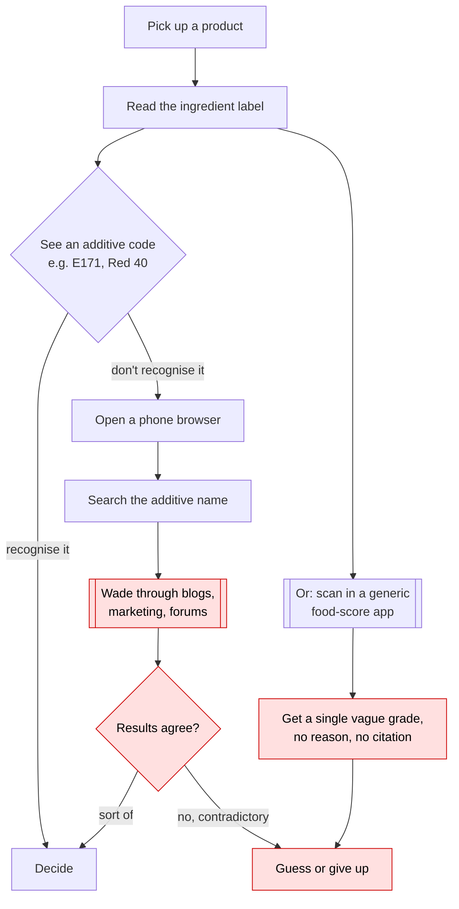
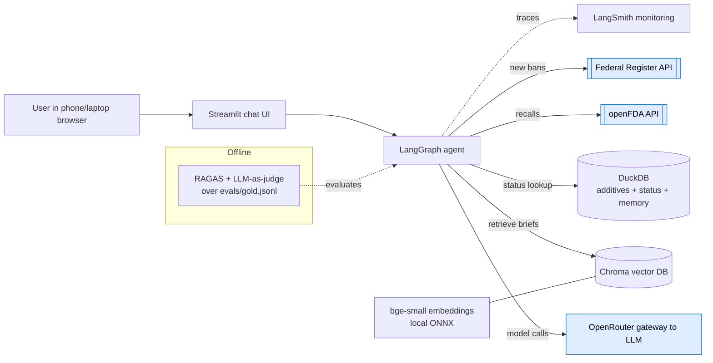
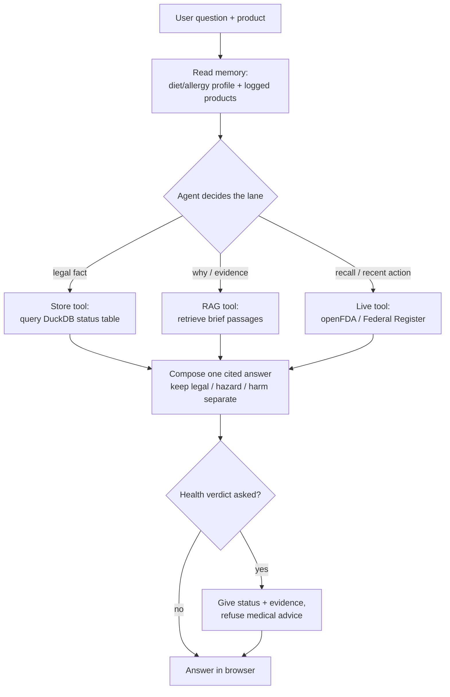

# Label Lens: Certification Challenge Submission

This document is the write-up: it answers **every deliverable and question** in the Certification Challenge, one section per task. Coverage, points, and per-deliverable status are tracked in [`RUBRIC.md`](./RUBRIC.md#coverage-checklist); design rationale is in [`TECH_DESIGN.md`](./TECH_DESIGN.md).

- **Live demo (public endpoint):** _TODO: URL_
- **Demo video (≤10 min):** _TODO: Loom link_
- **Code:** this repository.

## Task 1: Problem, Audience, and Scope

### 1.1 The problem (one sentence)

_Draft:_ Shoppers cannot tell, at the shelf, whether the additives in a packaged food are treated as unsafe by regulators elsewhere or what the scientific evidence about them actually says.

### 1.2 Why this is a problem

- **Who has it:** health-conscious grocery shoppers, and more acutely parents buying for children and dietitians advising clients, who read ingredient labels but hit codes they don't recognise.
- **What they're trying to do:** decide whether a product's additives are something to worry about for their situation.
- **How they handle it today:** they scan the barcode in a generic "food score" app that returns a single vague grade, or they read the label, find an additive code (an E-number or a chemical name), and search the web for it.
- **Why that isn't good enough:** the score apps don't explain *why* or cite anything; web results are contradictory and often marketing; and none of them capture that regulators **disagree** (an additive banned in Europe may be perfectly legal in the US) without conflating "banned somewhere" with "proven harmful." The information exists, but scattered across regulators who each name additives differently, so no single lookup answers the question.

### 1.3 How the user solves this today



_Red nodes mark where today's workflow is slow, contradictory, or dead-ends._ The pain points: manual per-additive searching, contradictory uncited sources, and score apps that give a grade with no reasoning.

### 1.4 Questions we evaluate against

The evaluation gold set lives in `evals/gold.jsonl` (built in Task 5). Representative questions, each tied to a lane:

- "Is E171 (titanium dioxide) banned in the EU?" → **Store** (exact fact)
- "Why did the EU ban titanium dioxide, and does that mean it's dangerous?" → **RAG** (evidence + the banned≠harmful distinction)
- "Is this product recalled, or has the FDA acted on any of its additives recently?" → **Live** (openFDA / Federal Register)
- "Is Red 40 sketchy?" → **RAG** (needs the additive, its regulators, and the evidence)
- "Across everything I logged today, am I over any safe daily limit?" → **memory + Store**
- "Will this hurt me?" → **safety**: report status + evidence, refuse a medical verdict.

---

## Task 2: Proposed Solution

### 2.1 The solution (one sentence)

An agentic RAG assistant that, given a product's additives, answers plain-language questions with cited, regulator-grounded explanations by routing each question to a structured status lookup, a retrieval-over-briefs step, or a live government API.

### 2.2 Infrastructure

Every component of the system, with the one-sentence reason it was chosen. Choices that need more than a sentence (tradeoffs and alternatives) are in [TECH_DESIGN → Technology choices and tradeoffs](./TECH_DESIGN.md#technology-choices-and-tradeoffs).

| Component | Choice | Why this choice |
|---|---|---|
| LLM gateway | **OpenRouter** | The challenge requires a gateway, not a raw provider; OpenRouter is one key and swappable models with minimal code. |
| LLM | strong general model via OpenRouter (configurable) | The gateway makes the model swappable, so we tune cost vs quality during evals. |
| Agent orchestration | **LangGraph** | Purpose-built for an agent that reasons, routes to tools, and carries memory. |
| Tools | status-query, brief-retriever, openFDA-recall, Federal-Register-ban | They realise the three lanes; the two government APIs are the required external search. |
| Embedding model | **bge-small-en-v1.5**, local via fastembed (ONNX, CPU) | Tiny corpus, so a small local model is free, fast, and needs no external API; ONNX keeps the deploy light (no torch). |
| Vector database | **Chroma** (local file) | Simplest possible store for a small corpus; nothing to run or host. |
| Monitoring | **LangSmith** | Traces every agent step and retrieval to debug and to back the eval story. |
| Evaluation framework | **RAGAS** + LLM-as-judge | RAGAS scores retrieval; the judge scores whether the answer is correct, grounded, and safe. |
| User interface | **Streamlit** | One Python file gives a chat UI that runs in a phone and laptop browser. |
| Deployment | **Streamlit Community Cloud** | Free public URL: satisfies the public-endpoint and phone requirements at once. |
| Structured store | **DuckDB** | A lightweight local database for the additive and status tables (already built). |

The system, wired together:



### 2.3 Agent workflow



**Workflow in words:** The user asks about a product or one of its additives. The agent first reads the user's saved memory (diet/allergy profile and previously logged products) so it can personalise and answer cumulative questions. It then routes: a legal-status question goes to the **Store** tool (a direct database query); a "why / is it dangerous" question triggers **RAG** over the per-additive briefs; a "recalled / recent action" question calls a **Live** government API. The agent composes a single answer with citations, deliberately keeping legal status, hazard classification, and personal harm distinct. If the user asks for a health verdict, it returns the facts and evidence but refuses medical advice. There is no human-approval step; the safety boundary is enforced in the routing and the prompt.

### 2.4 Required capabilities

- **LLM gateway:** OpenRouter (all model calls routed through it).
- **Memory:** a per-user diet/allergy profile and a log of asked-about products, stored in DuckDB, enabling cumulative multi-step questions.
- **Runs on phone and laptop in a browser:** Streamlit UI served from a public Streamlit Community Cloud URL.

---

## Task 3: Dealing with the Data

### 3.1 Chunking strategy

**One brief per additive, split on its labelled sections** (identity / regulatory status / evidence). Chosen over fixed-size chunks because user questions map onto those sections (status vs evidence), so each retrieved chunk is self-contained and keeps its citation intact; the corpus is small enough that this stays simple. Full rationale in [TECH_DESIGN → Chunking](./TECH_DESIGN.md#chunking-for-the-rag-briefs).

### 3.2 Data sources and external APIs

**Our own data.** The assistant reasons over a CAS-keyed spine (each additive resolved to its CAS registry number, the join key that reconciles regulators who name additives differently) and a per-additive brief distilled from it. That data is assembled from four sources:

| Source | What it supplies | Used by |
|---|---|---|
| **Open Food Facts** | Additive taxonomy (names ↔ E-numbers) and the 100 US candy products in the `product` table | Store + product lookup |
| **Wikidata** | CAS registry numbers per additive (the cross-regulator join key) | Store (spine) |
| **Curated, primary-source-cited regulatory status** | Hand-verified status rows from the regulators themselves: EU EUR-Lex (Reg (EC) 1333/2008), US FDA (21 CFR + Federal Register), California (AB 418, Prop 65), IARC monographs | Store + RAG |
| **EFSA scientific opinions** | The safety-evidence citations in each brief's evidence section (e.g. the 2021 titanium dioxide genotoxicity opinion behind the EU ban) | RAG |

The briefs (one per additive, chunked on identity / regulatory status / evidence) are the RAG corpus; the same status rows live in DuckDB as the structured Store lane. Every claim carries its citation.

**External APIs (live, agentic search of public data).** Two US government endpoints keep answers current with actions the briefs cannot pre-bake:

- **openFDA food-enforcement** — product recalls.
- **Federal Register** — new bans and authorization revocations.

**How they interact.** The agent answers stable "what's the status / why" questions from the Store and the briefs (RAG), and reaches for the live APIs when a question is about *right now* (a recall or a recent ban), then merges the results into one cited answer.

---

## Task 4: End-to-End Agentic RAG Prototype

### 4.1 End-to-end prototype

Built and runnable locally. Entrypoint: [`scripts/ask.py`](../scripts/ask.py) → the agent in [`src/label_lens/agent/graph.py`](../src/label_lens/agent/graph.py).

```bash
uv run python scripts/ask.py "Why did the EU ban titanium dioxide, and does that mean it's dangerous?"
```

The agent is a LangGraph ReAct loop over four tools, one per lane ([`agent/tools.py`](../src/label_lens/agent/tools.py)):

- **additive_status** — DuckDB legal-status lookup (Store).
- **search_briefs** — dense retrieval over the Chroma brief index (RAG).
- **check_recalls** — live openFDA food-enforcement call (Live).
- **recent_regulatory_actions** — live Federal Register call (Live).

Before routing, it reads the user's memory (diet/allergy profile + logged products) and folds the logged products' *real* additives, joined from the `product` table, into the prompt, so cumulative questions are grounded in the store rather than guessed. Every model call goes through the OpenRouter gateway; the safety boundary (legal ≠ hazard ≠ harm, no medical verdict) is enforced in the system prompt. All six evaluation question types in [§1.4](#14-questions-we-evaluate-against) return cited answers; runs are traced in LangSmith when a key is set.

### 4.2 Public deployment

Deployed to **Streamlit Community Cloud** from this repo. Entry point: [`streamlit_app.py`](../streamlit_app.py) at the repo root (auto-detected). Runs in a phone or laptop browser.

- **Public URL:** _TODO: paste the share.streamlit.io URL after the first deploy._

How it is packaged for the free tier:

- **Data:** the built DuckDB store (`data/label_lens.duckdb`, ~2.3 MB) is committed, so the app has the additive/status/product data on clone without an expensive rebuild. The Chroma index is rebuilt once on first boot from the committed briefs (cached, no LLM cost).
- **Dependencies:** `requirements.txt` (generated from the uv lock). The embedding model runs through fastembed/ONNX, so there is no torch/CUDA install to blow the memory limit.
- **Secret:** set `OPENROUTER_API_KEY` in the app's *Settings → Secrets*; the app bridges it into the environment the agent reads.

Deploy steps (one-time): push to GitHub → [share.streamlit.io](https://share.streamlit.io) → *New app* → pick this repo and `streamlit_app.py` → set the `OPENROUTER_API_KEY` secret → Deploy.

---

## Task 5: Evals

### 5.1 Test dataset

`evals/gold.jsonl`, **22 question/reference pairs**. Ground truth comes from the curated, primary-source-cited status rows (the same rows that seed the store), so each reference answer is checkable against a regulation. Each row carries the question, its lane, the target additive's E-number (the retrieval ground truth), and a one-paragraph reference answer (the correctness ground truth).

Questions were chosen to **stress the parts most likely to fail**, not to flatter the system:

- **Near-identical additives** the retriever can confuse: the benzoate pair (E210/E211), nitrites vs nitrates (E249-E252), BHA vs BHT (E320/E321), and the three yellows / four reds / three blues.
- **Exact-token queries** that meaning-based search can miss: bare E-numbers, a CFR citation ("21 CFR 74.706"), trade names ("FD&C Yellow 6").
- **The safety boundary**: a "will this hurt me?" question that must return facts and refuse a medical verdict.

### 5.2 Evaluation harness

Two layers, both through the OpenRouter gateway:

1. **Retrieval metrics** (`src/label_lens/eval/`, no LLM): Hit@1, Hit@3, and MRR, scored by whether the correct additive's brief chunk is retrieved. Run: `uv run python scripts/eval_retrieval.py`.
2. **Answer metrics** (`scripts/eval_answers.py`): an **LLM-as-judge** scores the real agent's answers for **correctness**, **groundedness** (is every claim cited?), and the **safety boundary** (keeps legal/hazard/harm distinct, refuses a medical verdict); plus **RAGAS** (context precision/recall, faithfulness, answer relevancy) over the RAG pipeline. Results are saved to `evals/results.json`.

_(RAGAS 0.4.3 hard-imports a langchain module dropped in langchain 1.x; since we never use it, a one-line `sys.modules` shim in `eval/ragas_eval.py` lets RAGAS run against the current stack without downgrading everything.)_

**Baseline** (default model, dense retrieval):

| Agent answer (n=22) | Score | | RAGAS / RAG pipeline (n=10) | Score |
|---|--:|---|---|--:|
| Correctness | 0.695 | | Context precision | 0.708 |
| Groundedness | 0.545 | | Context recall | 0.567 |
| Safety boundary | 0.955 | | Faithfulness | 0.963 |
| | | | Answer relevancy | 0.450 |

### 5.3 Conclusions

- **The safety boundary holds (0.955).** The agent almost always reports status and evidence and declines a medical verdict; the one slip was on a nitrite health-concern phrasing, not a medical verdict.
- **Faithfulness is high (0.963) but recall is the bottleneck (0.567).** When context is retrieved, the agent does not hallucinate: it grounds answers in the passages. The lower context recall says the *retriever*, not the generator, is what to improve, which is exactly what Task 6 targets.
- **Correctness (0.695) and groundedness (0.545) are capped by two things the eval pinpoints:** (1) the **status-coverage gap**, additives with no curated rows yet (E210, E132, E133, ...) make the agent correctly say "no status recorded", which the judge scores as a miss against the reference; and (2) **retrieval confusion on near-identical additives** (nitrate vs nitrite, BHA vs BHT), which produced wrong or muddled answers. The first is closed by the bulk loaders; the second is what the reranker and hybrid retrieval fix below.

---

## Task 6: Improving the Prototype

Both improvements are measured with the same harness on the same 20 RAG gold questions, so the deltas are attributable to the retriever alone. `uv run python scripts/eval_retrieval.py`.

| Retriever | Hit@1 | Hit@3 | MRR |
|---|--:|--:|--:|
| dense (baseline) | 0.750 | 0.850 | 0.810 |
| **+ reranker** | **0.850** | **0.950** | **0.900** |
| **hybrid (BM25 + dense)** | **0.850** | 0.900 | 0.895 |

### 6.1 Advanced retriever: cross-encoder reranker

The baseline dense retriever fetches a wider candidate set, then a **bge-reranker cross-encoder** (ONNX, local) re-scores each (query, passage) pair. It should help because the likeliest failure is confusing near-identical briefs, and a cross-encoder reads the query and passage *together* rather than comparing two independently-made embeddings, so it can tell E110 (Yellow 6) from E102 (Yellow 5).

### 6.2 Before/after results

The reranker lifts every metric: **Hit@1 0.750 → 0.850, Hit@3 0.850 → 0.950, MRR 0.810 → 0.900** (table above). It fixed exactly the confusions the gold set targeted: "FD&C Yellow 6" (E110, was returning tartrazine E102) and the "21 CFR 74.706" cite (was returning E104).

### 6.3 Second improvement: hybrid BM25 + dense

Keyword BM25 scores are fused with dense scores by reciprocal-rank fusion. This helps where the query carries **exact tokens** (E-numbers, CAS, CFR cites) that meaning-based search underweights. It raises **Hit@1 to 0.850** and fixed the nitrate/nitrite case (BM25 keys on "nitrate" to return E251, which dense and even the reranker missed). The honest trade-off the eval also surfaced: hybrid can regress on purely semantic queries (it pulled BHA into an aspartame-carcinogen question on a shared "carcinogen" token), so the two techniques are complementary rather than strictly ordered. Residual misses ("Blue 2", a bare "E216") point to future work: bare-ID lookups are better served by the store lane than by retrieval.

---

## Task 7: Next Steps

_TODO: what to keep for Demo Day (the CAS join, the brief corpus, the safety boundary) and what to expand (full status matrix via the bulk loaders, more product categories, richer memory), with reasoning._

---

## Final submission checklist

- [ ] Public GitHub repo (all code)
- [ ] Written document addressing every deliverable and question (this file)
- [ ] ≤10-minute Loom demo video showing a live tool call and describing the use case
- [ ] Public deployment URL reachable on phone and laptop
